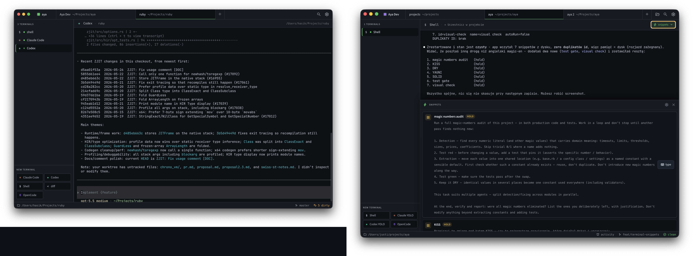

<div align="center">
  
  <h1>Aya</h1>
  <p>
    <strong>A desktop workspace for long-lived coding-agent terminals.</strong><br>
    Keep Claude Code, Codex, Aider, Gemini, OpenCode, Amp, Crush, Qwen Code,
    Kilo Code, Pi, and plain shell sessions organized by project.
  </p>
</div>

<p align="center">
  
</p>

<p align="center">
  <a href="https://github.com/khasinski/aya/actions/workflows/build.yml">
    
  </a>
</p>

---

## What Aya is

Aya is an Electron terminal manager for people who keep AI coding agents running
while they move between real projects. Each project is a directory. Each project
can have several terminals: Claude Code, Codex, Aider, another agent CLI, or a
normal shell. Switching projects hides terminals; it does not kill their PTYs.

The core workflow is simple:

1. Open a repo as an Aya project.
2. Start one or more terminal presets inside it.
3. Switch to other projects during the day.
4. Come back later and find the same agent sessions, panes, scrollback, status,
   snippets, and project context still there.

Aya does not proxy agent APIs, share accounts, scrape terminal output into a
service, or force a git-worktree workflow. It launches normal interactive CLIs
in normal PTYs.

## Why it exists

Many multi-agent tools are built around launching several agents in parallel
worktrees for one task, then comparing or merging the results. Aya is aimed at a
different daily pattern:

- You work across several repos, clients, or experiments.
- Each project usually has one checkout or branch you care about.
- Long-running terminal conversations are part of the work, not disposable
  output.
- Agents and shells should share the same project directory unless you choose
  otherwise.

Aya is project-first: top tabs are projects, the sidebar is that project's
terminals, and the search jumps across projects, terminals, recent output, and
run commands.

## Version 0.6 highlights

- **Desktop chrome polish.** Project tabs now own the window header on macOS
  and Linux, including better macOS fullscreen behavior and Linux custom
  draggable chrome.
- **Long-lived PTYs.** Terminals stay alive across project switches, window
  focus changes, and renderer remounts. A rolling buffer replays recent output
  when the renderer reconnects.
- **Agent-agnostic presets.** Aya auto-detects known harnesses on your
  login-shell PATH and seeds usable presets. Custom commands can be added from
  Settings.
- **Interactive launch policy.** Built-in Claude Code and Codex presets are
  plain `claude` and `codex`. Aya deliberately does not ship `-p`, `--print`,
  `--headless`, or other non-interactive defaults, and tests enforce that.
- **Project search.** `⇧⇧` or `⌘K` searches projects, terminal names, recent PTY
  output, and `Run ...` actions with AND semantics.
- **Splits and navigation.** Keep several agents or shells visible in one
  project, then focus adjacent panes from the keyboard.
- **Snippets.** Save prompts or commands in `~/.aya/snippets.json` and inject
  them into the active terminal. Snippets live in Aya's editor-side storage, not
  in any agent's conversation.
- **Status and attention.** Aya detects common approval prompts, shows sidebar
  attention dots, can badge the macOS dock, and can send native notifications
  when a terminal needs attention.
- **Usage chips.** Claude usage can be read from an explicit user-enabled hook
  that writes `~/.aya/usage.json`; Codex usage is read from local Codex session
  logs. Aya itself does not read Anthropic tokens or call Anthropic endpoints.
- **Early remote support.** Aya includes SSH-backed remote project
  opening and a local `aya remote --stdio` bridge. This is groundwork for fuller
  remote session sync; remote control is still intentionally limited.

## Install

Download Aya 0.7.2 from the GitHub release:

- macOS Apple Silicon: [DMG](https://github.com/khasinski/aya/releases/download/v0.7.2/Aya-0.7.2-arm64.dmg) or [zip](https://github.com/khasinski/aya/releases/download/v0.7.2/Aya-0.7.2-arm64-mac.zip)
- Linux x64: [AppImage](https://github.com/khasinski/aya/releases/download/v0.7.2/Aya-0.7.2.AppImage) or [deb](https://github.com/khasinski/aya/releases/download/v0.7.2/aya_0.7.2_amd64.deb)

### macOS

Open the DMG and drag Aya to `/Applications`. The release build is Developer ID
signed and Apple-notarized.

### Linux

On Ubuntu and Debian-like systems, prefer the DEB:

```sh
sudo apt install ./aya_0.7.2_amd64.deb
/opt/Aya/aya
```

The AppImage can be run directly:

```sh
chmod +x Aya-0.7.2.AppImage
./Aya-0.7.2.AppImage
```

If AppImage complains about FUSE, use the DEB.

## Build from source

Requirements:

- Node.js `>=24 <25 || >=26 <27`
- npm

Build and package for the current platform:

```sh
git clone https://github.com/khasinski/aya.git
cd aya
npm install
npm run package
```

macOS packaging produces:

- `release/mac-arm64/Aya.app`
- `release/Aya-<version>-arm64.dmg`
- `release/Aya-<version>-arm64-mac.zip`

Unsigned local macOS builds may need right-click -> Open the first time. See
[Signing macOS builds](docs/signing-macos.md) for release signing and
notarization.

To build Linux artifacts from macOS, compile `node-pty` for Linux in Docker:

```sh
docker run --rm --platform linux/amd64 \
  -v "$PWD":/project \
  -w /project \
  electronuserland/builder:wine \
  /bin/bash -lc 'npm ci && npm test && npx electron-builder --linux AppImage deb --x64'
```

Expected artifacts:

- `release/Aya-<version>.AppImage`
- `release/aya_<version>_amd64.deb`
- `release/linux-unpacked/`

## Development

Run the app in development mode:

```sh
npm install
npm run dev
```

`npm run dev` starts Vite, TypeScript watch mode for the Electron main process,
and `electronmon`. Development state lives in `~/.aya-dev/`, so it does not
touch production state in `~/.aya/`.

Common commands:

```sh
npm test          # typecheck + Electron build + test source build + node tests
npm run build    # renderer + Electron main build
npm run package  # build and package with electron-builder
```

## Daily use

### Open projects

Use the app's open-project flow, or install the CLI helper from Settings ->
General -> `aya` command-line tool and open projects from any shell:

```sh
aya
aya ~/code/my-repo
aya open ~/code/my-repo
```

If Aya is already running, the helper sends the open request to the existing
instance. If the project already exists, Aya switches to it.

For repo/dev builds, you can also put `bin/aya` on PATH yourself:

```sh
ln -s "$PWD/bin/aya" /usr/local/bin/aya
```

On macOS the helper can launch `/Applications/Aya.app` if Aya is not already
running. On Linux it expects an `aya-app` launcher on PATH; the DEB installs the
binary at `/opt/Aya/aya`, so add one if you want that cold-start workflow:

```sh
sudo ln -s /opt/Aya/aya /usr/local/bin/aya-app
```

### Start terminals

Each project gets launcher buttons for configured presets. First launch seeds
presets from agent CLIs found on your login-shell PATH, plus a shell fallback.
Settings can add suggested harnesses, edit commands, set agent metadata, and
label unsafe-mode presets.

Aya launches commands with `node-pty` under a login shell in the selected
project directory. The built-in agent presets are interactive CLIs, not
headless API wrappers.

### Use snippets

Snippets are saved reusable text blocks. They can type only, or append Enter and
run immediately. Multi-line snippets are sent with bracketed paste so rich TUIs
receive the text as one paste operation.

Snippets are stored in:

```text
~/.aya/snippets.json
```

### Use status commands

Terminals launched by Aya receive environment variables that let scripts and
agent skills talk back to the current pane:

- `AYA_SOCKET`
- `AYA_TERMINAL_ID`
- `AYA_PROJECT_SLUG`
- `AYA_PROJECT_DIR`
- `AYA_PRESET_ID`

The helper exposes a small local control surface:

```sh
aya focus
aya notify --title "Aya" "Needs approval"
aya status set "Running tests"
aya status waiting "Needs approval"
aya status done "Build passed"
aya status error "Tests failed"
aya status clear
```

The companion skill lives in `skills/aya-control/SKILL.md` and uses only this
public CLI side channel.

### Open remote projects

The v0.6 remote flow is SSH-based and early. From the new-project dialog, enter
an SSH target, browse directories on the remote host, create a remote project,
and start remote terminals through `ssh -tt`.

Remote support requires:

- Aya installed and running on the remote host.
- The `aya` helper available to the remote SSH session.
- SSH access already configured by the user.

The fuller design for synchronized remote sessions is still tracked in
`docs/remote-sessions.md`.

## Keyboard shortcuts

| Shortcut | Action |
|---|---|
| `⌘T` / `Ctrl+T` | New shell tab |
| `⌘W` / `Ctrl+W` | Close active terminal |
| `⌘K` or `⇧⇧` | Search projects, terminals, output, and run actions |
| `⌘F` / `Ctrl+F` | Find inside the active terminal |
| `⌘[` / `⌘]` | Previous / next terminal in the current project |
| `⌘⌥←/→/↑/↓` / `Ctrl+Alt+←/→/↑/↓` | Focus adjacent split pane |
| <code>⌘⌥\\</code> / <code>Ctrl+Alt+\\</code> | Split active pane right |
| `⌘⌥-` / `Ctrl+Alt+-` | Split active pane below |
| `⌘1..9` | Switch to project N |
| `⌘,` / `Ctrl+,` | Settings |
| `Shift+Enter` / `⌥Enter` | Insert a newline in a running rich TUI |
| `Shift+Enter` | Restart a cleanly exited terminal in the same pane |

Right-click a terminal in the sidebar for terminal actions such as restart,
rename, and close. Right-click or use the close button on a project tab to close
the project without deleting its JSON from disk.

## Configuration

Production state lives in `~/.aya/`. Development state lives in `~/.aya-dev/`.

```text
~/.aya/
  aya.sock                 # local app control socket
  aya-remote.sock          # local remote bridge socket
  projects/<slug>.json     # one hand-editable project file per project
  projects-state.json      # project tab order, open/recent projects, selection
  presets.json             # terminal launcher presets
  snippets.json            # saved snippet definitions
  themes.json              # terminal themes and active theme id
  usage.json               # optional usage snapshot read by top-bar chips
  window-state.json        # size, position, fullscreen/maximized state
```

Older configs with `projects-order.json` and `open-projects.json` migrate into
`projects-state.json` on launch. External edits to snippets, presets, themes,
and project JSON files are watched and reloaded while Aya is running.

Set `AYA_HOME=/path/to/dir` to use a separate state directory for screenshots,
scratch sessions, or isolated testing.

## Architecture

- **Renderer:** React 19, TypeScript, Vite, and xterm.js.
- **Main process:** Electron 42, `node-pty`, local sockets, config IO, git
  probes, remote bridge plumbing, and package integration.
- **PTY host:** child process that owns terminal processes and survives
  renderer reconnects; stale host detection protects app updates.
- **IPC:** shared contracts in `electron/types.ts`, validated at process
  boundaries.
- **Config writes:** atomic `.tmp` + rename writes for user state.
- **Git status:** read-only status commands with optional repository locks
  disabled so background checks do not leave `.git/index.lock`.
- **Notifications:** prompt detection strips ANSI/control sequences and matches
  common Claude/Codex approval prompts.

## Tests and CI

```sh
npm test
```

The test suite covers launch-safety for shipped presets, theme import,
configuration normalization, IPC validation, control sockets, usage parsing,
PTY buffers, project reloads, git parsing, remote bridge basics, and shared
constants.

GitHub Actions runs tests and renderer/main builds on pull requests and pushes
to `main`. Pushes to `main`, version tags (`v*`), and manual workflow runs also
package Linux x64 artifacts.

## Status

Aya is pre-1.0 and dogfooded daily by the author. macOS Apple Silicon release
builds are Developer ID signed and Apple-notarized. Linux x64 builds are
available as AppImage and DEB packages.

## License

MIT, see [LICENSE](LICENSE).
