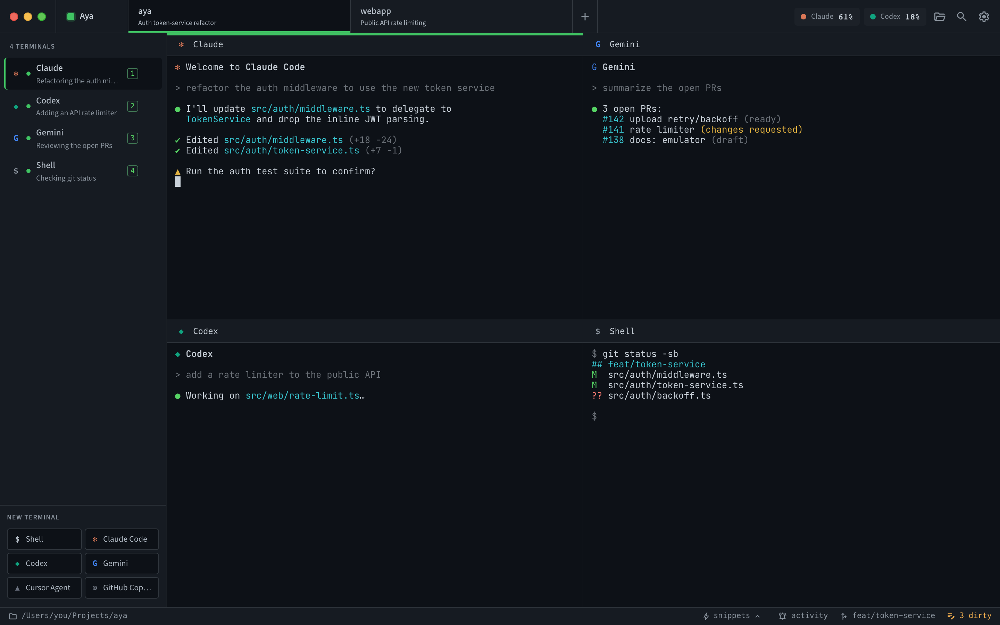

<div align="center">
  
  <h1>Aya</h1>
  <p>
    <strong>A desktop workspace for long-lived coding-agent terminals.</strong><br>
    Keep Claude Code, Codex, Aider, Gemini, OpenCode, Amp, Crush, Qwen Code,
    Kilo Code, Pi, and plain shell sessions organized by project.
  </p>
</div>

<p align="center">
  
</p>

<p align="center">
  <a href="https://github.com/khasinski/aya/actions/workflows/build.yml">
    
  </a>
</p>

---

## What Aya is

Aya is an Electron terminal manager for people who keep AI coding agents running
while they move between real projects. Each project is a directory. Each project
can have several terminals: Claude Code, Codex, Aider, another agent CLI, or a
normal shell. Switching projects hides terminals; it does not kill their PTYs.

The core workflow is simple:

1. Open a repo as an Aya project.
2. Start one or more terminal presets inside it.
3. Switch to other projects during the day.
4. Come back later and find the same agent sessions, panes, scrollback, status,
   snippets, and project context still there.

Aya does not proxy agent APIs, share accounts, scrape terminal output into a
service, or force a git-worktree workflow. It launches normal interactive CLIs
in normal PTYs.

## Why it exists

Many multi-agent tools are built around launching several agents in parallel
worktrees for one task, then comparing or merging the results. Aya is aimed at a
different daily pattern:

- You work across several repos, clients, or experiments.
- Each project usually has one checkout or branch you care about.
- Long-running terminal conversations are part of the work, not disposable
  output.
- Agents and shells should share the same project directory unless you choose
  otherwise.

Aya is project-first: top tabs are projects, the sidebar is that project's
terminals, and the search jumps across projects, terminals, recent output, and
run commands.

## Highlights

- **Every agent gets a real, persistent terminal.** Terminals live in a
  detached PTY host, so they survive project switches, window moves, app quits,
  and disconnects. Restored tabs resume the exact conversation; a rolling buffer
  replays recent output when the renderer reconnects.
- **Tiling splits.** Splitting divides only the selected pane, so the rest of
  the layout keeps its size. Layouts nest arbitrarily as a BSP tree, each
  divider drags independently, and pane navigation follows what you see.
- **One rail for attention.** A status rail lists every terminal that is waiting
  or failed across all open projects, including ones you are not looking at. The
  waiting state is read off each pane's real screen (a headless VT mirror), not
  a fragile byte-stream heuristic, so it also clears when the agent repaints.
- **Agents drive each other.** `aya pane read "reviewer"` returns another pane's
  output as plain text, as its screen shows it, and `aya pane send` types into
  it, so one agent hands work to another and collects the result. Panes are addressed by tab name within a project.
- **Teams of agents.** A team file in `.aya/teams/` gives panes roles (who
  they are, what they must not do, who they report to). Agents learn their
  role with `aya team whoami` and message each other by role, whatever the CLI
  or model; Aya logs every message and can run the rounds itself.
- **Apple Intelligence labels.** Aya reads each pane's output through Apple
  Intelligence, or a local Ollama / OpenAI-compatible model, and writes a
  one-line summary under every tab and project. On-device by default.
- **Many agents.** Presets for Claude Code, Codex, Cursor Agent, GitHub Copilot,
  Grok, Gemini, Aider, OpenCode, Kilo Code, Pi, Droid, Devin, and more, with
  session-precise resume via OSC 9001.
- **Usage in view.** Claude and Codex usage chips in the top bar, read from
  local snapshots. Aya does not proxy provider APIs or read Anthropic tokens.
- **Snippets, diffs, themes.** Inject saved prompts without spending agent
  context, keep branch and changed-file context in the status bar, and run a
  GPU-accelerated terminal with custom themes and a light or dark chrome.
- **Multiple windows and worktrees.** Chrome-style project-tab tear-out across
  windows; create, remove, and group git worktrees.
- **Aya Web (experimental).** Serve the same UI over a local HTTP + WebSocket
  bridge and reconnect to the same live sessions from a browser.
- **Early remote support.** SSH-backed remote project opening and a local
  `aya remote --stdio` bridge, as groundwork for fuller remote session sync.

## Install

Download the [latest release](https://github.com/khasinski/aya/releases/latest)
from GitHub (Aya 0.8.0):

- macOS Apple Silicon: [DMG](https://github.com/khasinski/aya/releases/download/v0.8.0/Aya-0.8.0-arm64.dmg) or [zip](https://github.com/khasinski/aya/releases/download/v0.8.0/Aya-0.8.0-arm64-mac.zip)
- Linux x64: [AppImage](https://github.com/khasinski/aya/releases/download/v0.8.0/Aya-0.8.0.AppImage) or [deb](https://github.com/khasinski/aya/releases/download/v0.8.0/aya_0.8.0_amd64.deb)

### macOS

Open the DMG and drag Aya to `/Applications`. The release build is Developer ID
signed and Apple-notarized.

### Linux

On Ubuntu and Debian-like systems, prefer the DEB:

```sh
sudo apt install ./aya_0.8.0_amd64.deb
/opt/Aya/aya
```

The AppImage can be run directly:

```sh
chmod +x Aya-0.8.0.AppImage
./Aya-0.8.0.AppImage
```

The AppImage ships the statically linked AppImage runtime, so it does **not**
need the obsolete `libfuse2`, which Ubuntu 24.04+ and Debian 13 no longer
install. It uses `fusermount3` from the `fuse3` package, which those
distributions do install by default.

On a system with no FUSE at all, run the AppImage without mounting it:

```sh
APPIMAGE_EXTRACT_AND_RUN=1 ./Aya-0.8.0.AppImage
```

Older releases (0.7.9 and earlier) embedded the legacy runtime and failed with
`dlopen(): error loading libfuse.so.2` / `AppImages require FUSE to run.`. Use
`APPIMAGE_EXTRACT_AND_RUN=1`, install `libfuse2t64`, or use the DEB.

### Desktop entry and icon (AppImage only)

An AppImage does not register itself, so the `.desktop` entry and the icons it
ships stay sealed inside the image. Until they are installed there is no Aya
entry in the menu, and the taskbar shows a generic placeholder instead of the
icon: on Wayland a window is associated with an application by matching its
`app_id` against installed `.desktop` files, and nothing else stands in for
that. (`StartupWMClass` does not - it is an X11 `WM_CLASS` hint, and Wayland has
no `WM_CLASS`.)

```sh
./scripts/install-desktop-entry.sh ./Aya-0.8.0.AppImage
```

That writes `~/.local/share/applications/aya.desktop` plus every icon size to
`~/.local/share/icons/hicolor/`, then refreshes the desktop and icon caches.
Re-run it after moving the AppImage, since the entry records an absolute path.
`--uninstall` removes both again.

DEB installs get this from dpkg and need none of it.

## Build from source

Requirements:

- Node.js `>=24 <25 || >=26 <27`
- npm

Build and package for the current platform:

```sh
git clone https://github.com/khasinski/aya.git
cd aya
npm install
npm run package
```

macOS packaging produces:

- `release/mac-arm64/Aya.app`
- `release/Aya-<version>-arm64.dmg`
- `release/Aya-<version>-arm64-mac.zip`
- `release/latest-mac.yml` for the in-app updater

Unsigned local macOS builds may need right-click -> Open the first time. See
[Signing macOS builds](docs/signing-macos.md) for release signing and
notarization.

To build Linux artifacts from macOS, compile `node-pty` for Linux in Docker:

```sh
docker run --rm --platform linux/amd64 \
  -v "$PWD":/project \
  -w /project \
  electronuserland/builder:wine \
  /bin/bash -lc 'npm ci && npm test && npx electron-builder --linux AppImage deb --x64'
```

Expected artifacts:

- `release/Aya-<version>.AppImage`
- `release/aya_<version>_amd64.deb`
- `release/latest-linux.yml` for AppImage updates
- `release/linux-unpacked/`

## Development

Run the app in development mode:

```sh
npm install
npm run dev
```

`npm run dev` starts Vite, TypeScript watch mode for the Electron main process,
and `electronmon`. Development state lives in `~/.aya-dev/`, so it does not
touch production state in `~/.aya/`.

Common commands:

```sh
npm test          # typecheck + Electron build + test source build + node tests
npm run build    # renderer + Electron main build
npm run package  # build and package with electron-builder
```

To trace what a terminal actually receives on input — key sequences, modifier
keys, application-mode escapes — set this in the renderer devtools console (the
flag is read per keystroke, so it takes effect immediately):

```js
localStorage.setItem("aya:debug-terminal-input", "1"); // "0" or removed = off
```

Every keystroke then lands in the console as `[aya terminal input] <terminal>
<preset>: <data>`. That includes anything you *paste*, so turn it off before
pasting a token or password into a terminal.

## Daily use

### Open projects

Use the app's open-project flow, or install the CLI helper from Settings ->
General -> `aya` command-line tool and open projects from any shell:

```sh
aya
aya ~/code/my-repo
aya open ~/code/my-repo
```

If Aya is already running, the helper sends the open request to the existing
instance. If the project already exists, Aya switches to it.

For repo/dev builds, you can also put `bin/aya` on PATH yourself:

```sh
ln -s "$PWD/bin/aya" /usr/local/bin/aya
```

On macOS the helper can launch `/Applications/Aya.app` if Aya is not already
running. On Linux it expects an `aya-app` launcher on PATH; the DEB installs the
binary at `/opt/Aya/aya`, so add one if you want that cold-start workflow:

```sh
sudo ln -s /opt/Aya/aya /usr/local/bin/aya-app
```

When `AYA_SOCKET` or `AYA_HOME` names an instance other than the installed
app's `~/.aya` (for example Aya Dev's `~/.aya-dev`, which panes inherit),
`aya open` never launches the installed app: it waits up to 15 seconds for
that instance's socket, then fails with the socket path.
`AYA_OPEN_WAIT_SECONDS` (whole seconds, at most 4 digits) changes the wait.

### Start terminals

Each project gets launcher buttons for configured presets. First launch seeds
presets from agent CLIs found on your login-shell PATH, plus a shell fallback.
A login shell that does not answer within 2.5 s is not read as "not installed":
that launch shows what it found but saves nothing, and the next launch scans again.
Settings can add suggested harnesses, edit commands, set agent metadata, and
label unsafe-mode presets.

Aya launches commands with `node-pty` under a login shell in the selected
project directory. The built-in agent presets are interactive CLIs, not
headless API wrappers.

### Use snippets

Snippets are saved reusable text blocks. They can type only, or append Enter and
run immediately. Multi-line snippets are sent with bracketed paste so rich TUIs
receive the text as one paste operation.

Snippets are stored in:

```text
~/.aya/snippets.json
```

### Use status commands

Terminals launched by Aya receive environment variables that let scripts and
agent skills talk back to the current pane:

- `AYA_SOCKET`
- `AYA_TERMINAL_ID`
- `AYA_PROJECT_SLUG`
- `AYA_PROJECT_DIR`
- `AYA_PRESET_ID`

The helper exposes a small local control surface:

```sh
aya focus
aya notify --title "Aya" "Needs approval"
aya status set "Running tests"
aya status waiting "Needs approval"
aya status done "Build passed"
aya status error "Tests failed"
aya status clear

# Read or drive another pane (resolved by tab name within your project;
# a name in two projects needs --project <slug> or the id from aya pane list)
aya pane read "reviewer"
aya pane read "reviewer" --project libeval
aya pane send "reviewer" "run the tests"
aya pane send "reviewer" --no-submit "draft for review"

# Work as a team (see "Run a team of agents")
aya team whoami
aya team show                                         # every role, lead, cadence, protocol
aya team send implementer "Round 5: the alert freezes at zero"
aya team inbox
aya team pause "no lower complexity is possible"      # the lead ends the work
aya team new "a team that reviews and fixes the UX"   # guide for an agent
aya team save ux-fix.md                                # check and save it
aya presets                                            # presets, installed or not
aya team open ux-fix reviewer=claude fixer=codex tester=this  # give roles panes
aya team start ux-fix "make the timer pausable"        # Start, with a task
aya debug on                                           # log every team decision
aya team debug ux-fix -f                               # read and follow that log

# Every command above, as JSON, for an agent to read
aya capabilities
```

`aya pane` is how one agent hands work to another and collects the result. A
pane name that is ambiguous within the project is rejected rather than guessed,
and `pane send` presses Enter after the text unless you pass `--no-submit`
(type only, for a prompt a human should review first). `--submit` is still
accepted, in any position, and changes nothing.

Every command knows its pane by `AYA_TERMINAL_ID`, so a CLI that runs the
agent's commands in a shared background process hands them the env of
whichever pane started that process. Interactive Codex does this with its
app-server daemon (measured on codex-cli 0.158.0), so Aya starts Codex panes
with `--no-daemon` when the installed codex has it (not `codex exec` and other
non-interactive subcommands). `aya` also sends its own pid, and the team
commands that speak as the pane (`aya team whoami|show|send|inbox|pause`) are
refused when that pid does not run under the pane's process or runs through a
`codex app-server`, naming this cause; restart that pane. The directory a
command runs in is not checked (see docs/teams.md, "A borrowed id").

`aya capabilities` is the machine-readable form of this list, so an agent can
learn the commands from the CLI itself instead of from a copied skill file.
Aya also counts, per harness, how many panes ever called `aya` at all; the
numbers are under `cliAdoption` in Settings -> Diagnostics.

To tell an agent the CLI exists, turn on "Tell the agent about aya" on its
preset (Settings -> Presets; off by default). It adds a six-line note that
points at `aya capabilities`, through whatever channel the harness has:
Claude gets it via `--append-system-prompt` and Grok via `--rules` at launch,
opencode via `OPENCODE_CONFIG`, or `OPENCODE_CONFIG_CONTENT` when you set your own
`OPENCODE_CONFIG` (added to your own instructions, in Aya panes only), Antigravity via its own always-on rule in `~/.gemini/config/rules/`
(deleted when you turn it off), and Codex via `-c developer_instructions` at launch (a user's own
`developer_instructions` is never replaced; the pane then goes without). Earlier versions put
Codex's note into a marked section of `AGENTS.md`; Aya removes the sections it recorded once, at startup.
Harnesses without a channel do not show the toggle. The bundled `aya` is
also on every pane's PATH, after any shim you installed.

The companion skill lives in `skills/aya-control/SKILL.md` and uses only this
public CLI side channel.

### Run a team of agents

Open **teams** in the status bar and choose **New team**. A team lists roles;
each role has responsibilities, one thing it must not do, and the roles it
sends to, each with what it sends there ("implementer: findings to fix"). Add
a protocol (how the roles work together), the lead, and, if you want rounds on a
timer, how often the lead gets them (the rhythm belongs to the lead). The **Flow preview** under the editor draws who sends
what to whom and flags a role nobody sends to. **Draft** fills a role from its
name and the rest of the team with your Aya Intelligence model (Apple
on-device can take up to a minute); edit it before **Save team**. The team is
saved to `.aya/teams/<name>.md`, so it travels with the repo. Edits made to
that file outside the teams window take effect only after you save them in
Aya.

Give each role a pane, in the teams window or from a tab's menu (**Team
role**), then press **Start**. Every role gets a delivery test. Pane roles, the
log and the pause state stay on your machine, in `~/.aya/teams/`.

A pane with a role is told about it at launch (only Claude, Grok, Codex and
OpenCode get a note; other CLIs say they cannot) and runs `aya team whoami` to
read its responsibilities, and what it sends to whom, again after `/clear` or
`/resume`. `aya team send
<role> "text"` types a dated line like `[team ux-review | from tester | 14:02 |
a1b2c3d] text` into that role's pane. Aya does not type it when Enter would do
something else: an approval prompt on screen, text you are typing there, or a
plain shell. That message waits for `aya team inbox` instead, and the sender is
told why. "Written to the pane" is not proof the agent read it. **Pause** stops
the rounds and all sends; **Resume** brings them back. The team's lead can pause
it too, with `aya team pause "why"`, when the work is done. A team you paused is
resumed only by you: `aya team start` from a role's own pane is refused (roles
give each other work with `aya team send`). The Teams window counts a change to
the repo (a commit or an edit) as progress; roles that only message each other
are "talking", and stalled after 60 min with no change. Teams work on local
panes only.

To see why a team does what it does (a held message, a skipped round, the
brake), run `aya debug on` and read `aya team debug <team>`; it is off by
default and costs nothing then. See [docs/teams.md](docs/teams.md#debug-on).

How a CLI is launched decides whether its `aya` calls reach Aya at all:
Codex's default sandbox blocks the socket, and OpenCode's plan agent never
edits. A pane Aya opens for a role gets a mode that reaches Aya (for Codex,
`-c sandbox_workspace_write.network_access=true`, never full access); a preset
that would need more is refused with the reason. An open pane that cannot
reach Aya still takes the role, but its status says why and **Start** leaves
nothing in it. `aya presets` shows which presets reach Aya. The measurements
are in [docs/teams.md](docs/teams.md#states-a-team-depends-on).

#### Define a team from an agent

Ask the agent in any pane, whatever its CLI, for the team you want: "aya team
new - a team for this project that reviews and fixes the UX of the game". The
agent runs `aya team new "<what the team is for>"`, which prints a guide: the
team file format with a complete example, every rule Aya checks, and what
makes a role work (a must-not never forbids the role's own work, a route says
in a few words what it carries). The agent looks at the project, writes the
file and runs `aya team save <file>` (or `aya team save -` with the file on
stdin). Aya checks it the way **Save team** does: on a problem it prints it,
saves nothing and exits 1; otherwise it writes `.aya/teams/<name>.md`, saves
the team in Aya, and prints each role and who it sends to. The teams window
shows it within seconds. An existing team is overwritten only with
`--replace`.

Then the agent gives the roles panes: it runs `aya presets` and `aya pane
list`, proposes which pane plays which role, and after your yes runs `aya team
open ux-fix reviewer=claude fixer=claude tester=this`. Each role gets a new
session of a preset (several roles can share one preset, each in its own
pane), the agent's own pane (`this`), or an open pane by name. If a pane is
named like a preset id, Aya asks for `new:<preset>` or `pane:<name>`. Aya checks
every pick first and opens nothing on a problem. Then the agent asks whether
to start and with what task; on your word it runs `aya team start ux-fix
"make the timer pausable"` (or you press **Start**, with an optional task).
The task goes to the team's lead (`## Lead` in the team file; the role with the
optional `## Cadence` is the lead), and Aya says who got it (the Task field names
the recipient, and a select picks another role). When nothing moves for 30 minutes
Aya asks the lead for a round that says who waits on whom (then every 10 minutes),
also in a team with no cadence; after 60 minutes without a change to the repo
(a commit or an edit; messages alone do not count) the team shows as stalled and the
lead is told so once. In the
teams window, each role's pane list offers the same: open panes, labelled
with the role they already play ("shell 1 (plays tester)"), and `New: <preset>`; **Apply panes** applies
the picks.

### Open remote projects

The remote flow is SSH-based and early. From the new-project dialog, enter
an SSH target, browse directories on the remote host, create a remote project,
and start remote terminals through `ssh -tt`.

Remote support requires:

- Aya installed and running on the remote host.
- The `aya` helper available to the remote SSH session.
- SSH access already configured by the user.

The fuller design for synchronized remote sessions is still tracked in
`docs/remote-sessions.md`.

## Keyboard shortcuts

| Shortcut | Action |
|---|---|
| `⌘T` / `Ctrl+T` | New shell tab |
| `⌘W` / `Ctrl+W` | Close active terminal |
| `⌘K` or `⇧⇧` | Search projects, terminals, output, and run actions |
| `⌘F` / `Ctrl+F` | Find inside the active terminal |
| `⌘[` / `⌘]` | Previous / next terminal in the current project |
| `⌘⌥←/→/↑/↓` / `Ctrl+Alt+←/→/↑/↓` | Focus adjacent split pane |
| <code>⌘⌥\\</code> / <code>Ctrl+Alt+\\</code> | Split active pane right |
| `⌘⌥-` / `Ctrl+Alt+-` | Split active pane below |
| `⌘1..9` | Switch to project N |
| `⌘,` / `Ctrl+,` | Settings |
| `Shift+Enter` / `⌥Enter` | Insert a newline in a running rich TUI |
| `Shift+Enter` | Restart a cleanly exited terminal in the same pane |

Right-click a terminal in the sidebar for terminal actions such as restart,
rename, and close. Right-click or use the close button on a project tab to close
the project without deleting its JSON from disk.

## Configuration

Production state lives in `~/.aya/`. Development state lives in `~/.aya-dev/`.

```text
~/.aya/
  aya.sock                 # local app control socket
  aya-remote.sock          # local remote bridge socket
  projects/<slug>.json     # one hand-editable project file per project
  projects-state.json      # project tab order, open/recent projects, selection
  presets.json             # terminal launcher presets
  snippets.json            # saved snippet definitions
  themes.json              # terminal themes and active theme id
  usage.json               # optional usage snapshot read by top-bar chips
  window-state.json        # size, position, fullscreen/maximized state
```

Older configs with `projects-order.json` and `open-projects.json` migrate into
`projects-state.json` on launch. External edits to snippets, presets, themes,
and project JSON files are watched and reloaded while Aya is running.

Set `AYA_HOME=/path/to/dir` to use a separate state directory for screenshots,
scratch sessions, or isolated testing.

A remote host answers with its installed Aya (`~/.aya/aya-remote.sock`), even
when an Aya Dev also runs there. To reach the dev build over ssh, set
`AYA_HOME="$HOME/.aya-dev"` or `AYA_REMOTE_SOCKET` on the host - see
[docs/remote-sessions.md](docs/remote-sessions.md#which-aya-on-the-host-answers).

## Architecture

- **Renderer:** React 19, TypeScript, Vite, and xterm.js.
- **Main process:** Electron 43, `node-pty`, local sockets, config IO, git
  probes, remote bridge plumbing, and package integration.
- **PTY host:** child process that owns terminal processes and survives
  renderer reconnects; stale host detection protects app updates.
- **IPC:** shared contracts in `electron/types.ts`, validated at process
  boundaries.
- **Config writes:** atomic `.tmp` + rename writes for user state.
- **Git status:** read-only status commands with optional repository locks
  disabled so background checks do not leave `.git/index.lock`.
- **Notifications:** prompt detection strips ANSI/control sequences and matches
  common Claude/Codex approval prompts.

## Tests and CI

```sh
npm test
```

The test suite covers launch-safety for shipped presets, theme import,
configuration normalization, IPC validation, control sockets, usage parsing,
PTY buffers, project reloads, git parsing, remote bridge basics, and shared
constants.

GitHub Actions runs tests and renderer/main builds on pull requests and pushes
to `main`. Pushes to `main`, version tags (`v*`), and manual workflow runs also
package Linux x64 artifacts.

## Status

Aya is pre-1.0 and dogfooded daily by the author. macOS Apple Silicon release
builds are Developer ID signed and Apple-notarized. Linux x64 builds are
available as AppImage and DEB packages.

## License

MIT, see [LICENSE](LICENSE).
